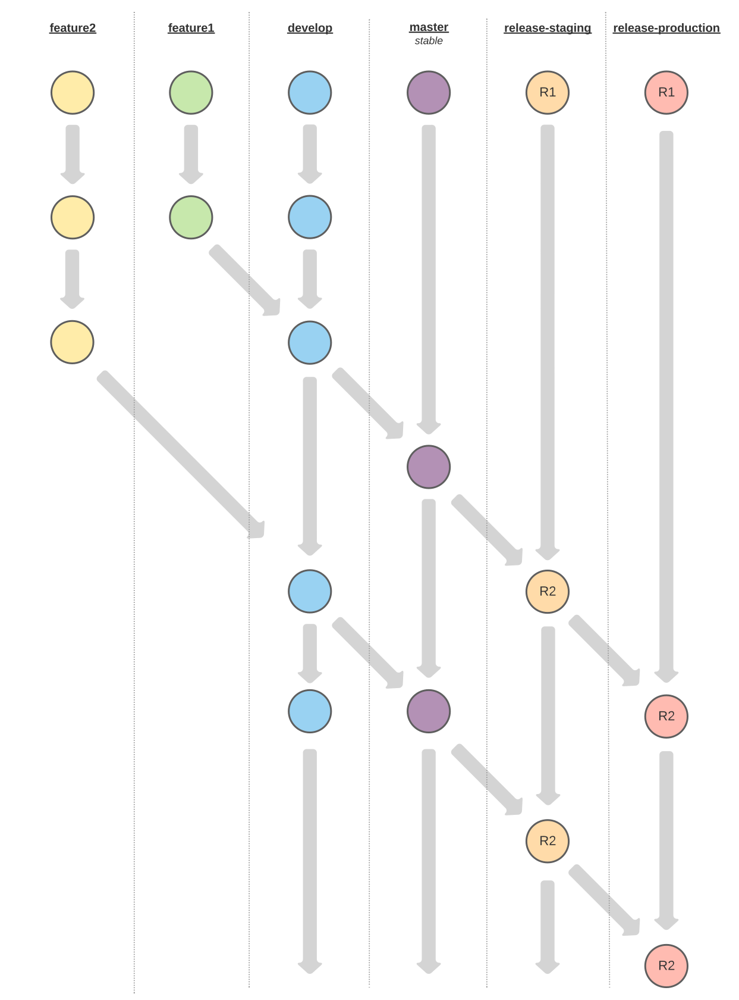

# Backend System for the DAITA Platform

## A Note on Releases

The repository should be setup in the future in such a way that changes to the branch `release-staging` and `release-production` will trigger a rebuild of the Staging and the Production application, respectively.

The merge flow for changes should be as follows:

```bash
<feature_branch> -> <develop> -> <main> -> <release-staging> -> <release-production>
```


