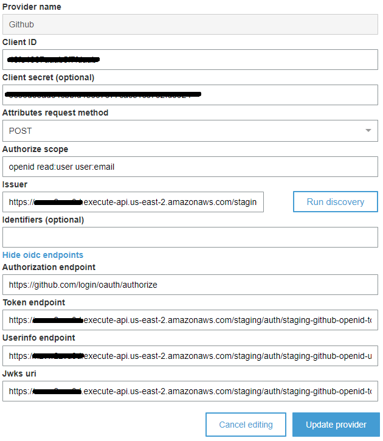
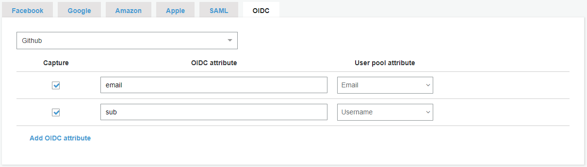

# Cognito with Github

*ref: [github-cognito-openid-wrapper](https://github.com/TimothyJones/github-cognito-openid-wrapper)*

Why does Cognito not support federation with OAuth? Because OAuth provides no standard way of requesting user identity data. (see the [background](https://github.com/TimothyJones/github-cognito-openid-wrapper#background) section for more details).

So in order to use Github as an Identity provider, we introduce a wrapper to make Github OAuth API comply with [OIDC User Pool IdP authentication flow](https://docs.aws.amazon.com/cognito/latest/developerguide/cognito-user-pools-oidc-flow.html) used by Cognito.

The OIDC User Pool required four endpoints, which are:

- Authorization - used to start the authorisation process ([spec](https://openid.net/specs/openid-connect-core-1_0.html#AuthorizationEndpoint)) -> we will use Github default endpoint
- Token - used to exchange an authorisation code for an access and ID token ([spec](https://openid.net/specs/openid-connect-core-1_0.html#TokenEndpoint)) -> Wrap this
- UserInfo - used to exchange an access token for information about the user ([spec](https://openid.net/specs/openid-connect-core-1_0.html#UserInfo)) -> Wrap this
- jwks - used to describe the keys used to sign ID tokens ([implied by spec](https://openid.net/specs/openid-connect-discovery-1_0.html#ProviderMetadata)) -> This will be left as dummy endpoint.

### 1: Setup

We will need to:

- Create a Cognito User Pool ([instructions](https://docs.aws.amazon.com/cognito/latest/developerguide/cognito-user-pool-as-user-directory.html)).
- Configure App Integration for your User Pool ([instructions](https://docs.aws.amazon.com/cognito/latest/developerguide/cognito-user-pools-configuring-app-integration.html)). Note down the domain name.
- Create a GitHub OAuth App ([instructions](https://developer.github.com/apps/building-oauth-apps/creating-an-oauth-app/), with the following settings:
  - Authorization callback URL: `https://<Your Cognito Domain>/oauth2/idpresponse`
  - Note down the Client ID and secret

(If you use GitHub Enterprise, you need the API & Login URL. This is usually `https://<GitHub Enterprise Host>/api/v3` and `https://<GitHub Enterprise Host>`, modify those value at
[config.py](../core_service/aws_lambda/project/common/config.py))

### 2: Deploy lambda and API Gateway

Source code for wrapper of [/token](../core_service/aws_lambda/project/code/github_openid_token_wrapper.py) and [/userinfo]((../core_service/aws_lambda/project/code/github_openid_userinfo_wrapper.py)) lambda function

Detail about lambda deployment and API Gateway config can be found in [de_lambda_auth_funcs.py](../core_service/aws_lambda/project/de_lambda_auth_funcs.py)

### 3: Finalise Cognito configuration

- Configure the OIDC integration in AWS console for Cognito (described below, but following [these instructions](https://docs.aws.amazon.com/cognito/latest/developerguide/cognito-user-pools-oidc-idp.html)). The following settings are required:
  - Client ID: The GitHub Client ID above
  - Authorize scope: `openid read:user user:email`
  - Issuer: `https://<Your API Gateway DNS name>/${Stage_Name}`
  - If you have deployed the web app: Run discovery (big blue button next to Issuer).
  - If you have deployed the lambda/Gateway: For some reason, Cognito is unable to
    do OpenID Discovery. You will need to configure the endpoints manually. They are:
    - Authorization endpoint: `https://github.com/login/oauth/authorize`
    - Token endpoint: `https://<Your API Gateway DNS name>/${Stage_Name}/token`
    - Userinfo endpoint: `https://<Your API Gateway DNS name>/${Stage_Name}/userinfo`
    - JWKS uri, we just put a dummy endpoint here: `https://<Your API Gateway DNS name>/${Stage_Name}/token`

- Configure the Attribute Mapping in the AWS console:

- Ensure that your new provider is enabled under **Enabled Identity Providers** on the App Client Settings screen under App Integration.

***For more details please read the docs at [github-cognito-openid-wrapper details](https://github.com/TimothyJones/github-cognito-openid-wrapper#the-details)**