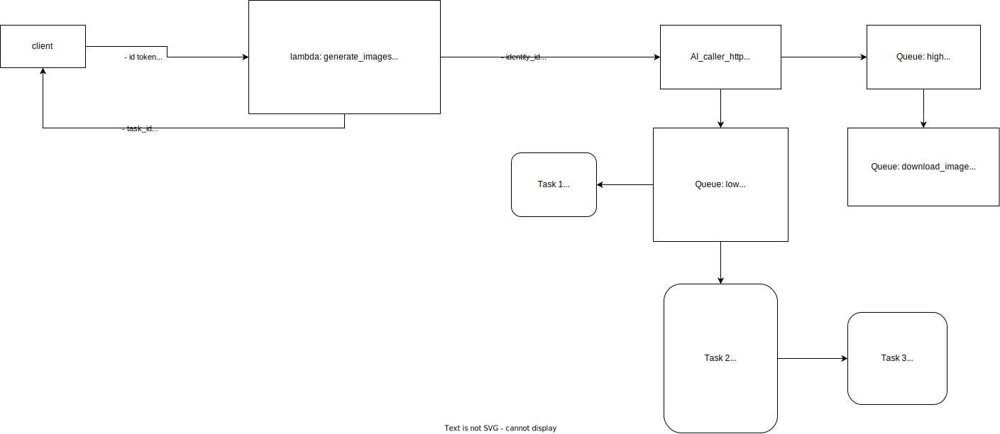

- [High-Level Architecture](#high-level-architecture)
- [Main System Components](#main-system-components)
- [AWS Services](#aws-services)
- [*ai_caller_service*](#ai_caller_service)
- [*download_service*](#download_service)
- [Preprocessing and Augmentation Flow](#preprocessing-and-augmentation-flow)
- [URL Endpoints](#url-endpoints)

## High-Level Architecture

## Main System Components

There are 4 main service components in the backend system:
- *core_service*: Processing the request from the client and sending the task to the corresponding service.
- *ai_caller_service*: Managing the connection between the AWS service and the AI tasks and updating the progress from the AI service.
- *ai_service*: Execution of AI tasks such as preprocessing or augmentation.
- *download_service*: Supporting the download progress.

## AWS Services

We list the AWS services used in this system:

- [API Gateway](https://aws.amazon.com/api-gateway): Defining the URL endpoint.
- [Lambda](https://aws.amazon.com/lambda): Processing a customer request.
- [Cognito](https://aws.amazon.com/cognito): Managing user authentication.
- [S3](https://aws.amazon.com/s3), [Elastic File System](https://aws.amazon.com/efs): Managing data storage.
- [EC2](https://aws.amazon.com/ec2): Deployment of *ai_caller_service*, *download_service*, and *ai_task*.
- [DynamoDB](https://aws.amazon.com/dynamodb): Managing NoSQL database.
- [SES](https://aws.amazon.com/ses): Managing transactional emails.
- [SQS](https://aws.amazon.com/sqs): Managing message queuing.
- [KMS](https://aws.amazon.com/kms): Key management for encryption and decryption.
- [CloudWatch](https://aws.amazon.com/cloudwatch): Monitoring our AWS resources and applications.
- [Amplify](https://aws.amazon.com/amplify): Deploying the React-based interface.

## *ai_caller_service*

Detailed documentation can be found [here](./ai-caller.md).

## *download_service*

Detailed documentation can be found [here](./download-service.md).

## Preprocessing and Augmentation Flow

## URL Endpoints

The full list of URL endpoints can be found [here](./url-endpoint-aws-service.md).
