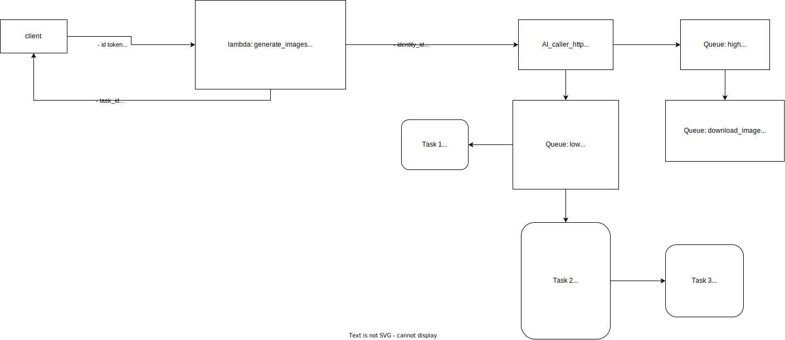

- [General Architect](#general-architect)
- [Main components in system](#main-components-in-system)
- [AWS services](#aws-services)
- [AI caller service](#ai-caller-service)
- [Download service](#download-service)
- [Preprocess/Augment flow](#preprocessaugment-flow)
- [URL endpoint](#url-endpoint)

# General Architect

# Main components in system
In the backend system, there are 4 main service components:
- Core processing service (Lambda, APIGateway, ...): process the request from client and send task to corresponding service
- AI_caller_services: manage the connection between AWS service and AI and update the progress from AI service
- AI service: execute the AI tasks as preprocessing, augmentation
- Download_service: support download progress
  
# AWS services
We list out the AWS services that using in this system:
- APIGateway: define url endpoint 
- Lambda: process request from client
- Cognito: manage users authentication
- S3, Elastic File System: data storage
- EC2: deploy ai_caller_service, download_service, ai_task
- DynamoDB: database storage
- SES: mail service
- SQS: queue task
- KMS: key manager for encrypt and decrypt
- CloudWatch: log storage
- Amplify: deploy front-end

# AI caller service
[Document](./rm_ai_caller.md)

# Download service
[Document](./rm_download_service.md)

# Preprocess/Augment flow

# URL endpoint
- [List url endpoint](./rm_url_endpoint_aws_service.md)
